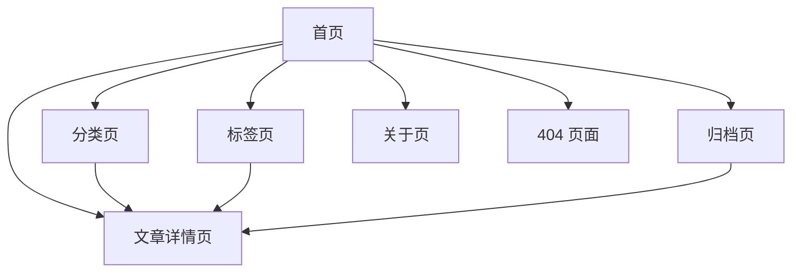

# GitHub 博客网站设计方案

## 1. 方案定位

本方案基于当前 `web` 目录下已有的 Vue + Vite 博客骨架制定，重点参考了现有 5 个一级页面路由：

- 首页 `Home`
- 分类 `Categories`
- 标签 `Tags`
- 归档 `Archive`
- 关于 `About`

当前框架特点：

- 已有基础导航结构
- 已有页面切换和基础主题变量
- 已接入 Markdown 渲染相关依赖
- 页面内容仍处于占位阶段，适合先完成信息架构和界面设计，再进入开发

本方案目标：

- 保留现有 5 个核心页面
- 补齐博客真正可用所需的关键页面
- 让页面布局、模块职责、交互规则都明确
- 用 Markdown 文档沉淀，后续你可以随时增删改

新增设计要求：

- 整站美术风格调整为“竹林隐士”方向
- 文章详情页中的 `.md` / `.kmd` 渲染方式，必须与 `code` 目录中的笔记工具保持完全一致
- 方案中补充“快速更新网站”的操作方式，尤其是新增文章流程

---

## 2. 可直接修改的站点配置

你后续如果想快速改方案，优先修改这部分即可。

```yaml
site_name: "你的博客名"
site_positioning: "竹林中的个人知识园林 / 技术博客 / 隐士感笔记站"

design_style:
  keywords:
    - "竹林风格"
    - "隐士感"
    - "东方留白"
    - "山雾感"
    - "纸墨质感"
  primary_color: "#5C7A3A"
  accent_color: "#A67C52"
  background_style: "米白宣纸底 + 淡竹影 + 雾气渐变"

navigation:
  - name: "首页"
    path: "/"
    enabled: true
  - name: "分类"
    path: "/categories"
    enabled: true
  - name: "标签"
    path: "/tags"
    enabled: true
  - name: "归档"
    path: "/archive"
    enabled: true
  - name: "关于"
    path: "/about"
    enabled: true

extra_pages:
  - name: "文章详情"
    path: "/post/:slug"
    enabled: true
  - name: "搜索结果"
    path: "/search"
    enabled: false
  - name: "404"
    path: "/404"
    enabled: true

homepage_modules:
  hero: true
  featured_posts: true
  latest_posts: true
  category_preview: true
  tag_preview: true
  about_preview: true
  continue_reading: true

post_page_modules:
  article_toc: true
  article_meta: true
  prev_next_nav: true
  related_posts: true
  comments: false
  copy_link: true
  identical_renderer_with_note_tool: true

future_features:
  local_search: true
  reading_progress: true
  dark_mode_toggle: true
  view_count: false

content_update:
  posts_dir: "public/posts"
  about_file: "public/about.md"
  index_file: "src/data/posts.json"
  auto_generate_index: true
```

---

## 3. 推荐最终界面数量

建议网站最终规划为 `7` 个界面。

### 核心上线界面

1. 首页
2. 分类页
3. 标签页
4. 归档页
5. 关于页
6. 文章详情页

### 辅助界面

7. 404 页面

说明：

- 现有框架已经有前 5 个页面
- `文章详情页` 是博客真正可用的核心页面，建议必须补上
- `404 页面` 对 GitHub Pages 场景很实用，能避免空白错误页影响体验

可选扩展界面：

- 搜索页
- 友链页
- 项目页
- 留言页

---

## 4. 网站信息架构



---

## 5. 全站统一布局规范

### 5.1 页面框架

所有页面建议统一采用以下结构：

1. 顶部导航区
2. 页面主内容区
3. 页脚信息区

统一好处：

- 页面切换时观感稳定
- 后续维护成本低
- 更适合 GitHub Pages 的静态博客结构

### 5.2 顶部导航区

建议包含：

- 左侧：博客名称 / Logo
- 中间：一级导航
- 右侧：主题切换、搜索入口、GitHub 外链

布局建议：

- 桌面端：横向导航，居中对齐
- 移动端：折叠菜单 + 顶部标题栏
- 样式：半透明纸感导航条，滚动时保持吸顶

### 5.3 主内容区

建议统一最大宽度：

- 普通列表页：`1100px - 1200px`
- 文章详情页：正文列 `760px - 820px`
- 关于页：可放宽到 `1200px`

### 5.4 页脚区

建议包含：

- 版权信息
- GitHub 链接
- RSS/订阅预留位
- 构建说明，如 `Powered by Vue + Vite + GitHub Pages`

### 5.5 美术风格规范：竹林隐士风

整体气质不再走偏“科技玻璃感”，而是调整为：

- 安静
- 克制
- 有山林书卷气
- 像“竹林中的个人书斋”

### 视觉关键词

- 竹影
- 山雾
- 宣纸
- 木色
- 墨绿
- 留白
- 清晨微光

### 颜色建议

- 主色：竹青绿 `#5C7A3A`
- 深色：墨竹绿 `#314127`
- 辅色：木棕 `#A67C52`
- 背景色：宣纸白 `#F7F4EC`
- 次背景：雾灰绿 `#E8EFE3`
- 点缀色：苔藓绿 `#7C9A56`

### 背景表现

- 首页和关于页可加入浅层竹影纹理
- 避免大面积强渐变和强玻璃模糊
- 用“半透明雾层 + 纸张质感 + 细边框”替代现代霓虹感

### 卡片风格

- 卡片像书签、竹简、纸页，而不是悬浮仪表盘
- 圆角建议减小，避免过于现代化
- 阴影轻、边框细、悬浮反馈弱一点

### 字体建议

- 中文标题：优先更有书卷气的字体风格
- 英文辅助字体：可保留 `Inter`，但只用于元信息和 UI
- 正文以高可读为主，不建议为了风格牺牲阅读性

### 动效建议

- 页面切换：淡入淡出，如雾散雾起
- Hover：轻微位移或边框加深即可
- 避免赛博感光效、炫光扫过、过强 3D 倾斜

---

## 6. 各界面详细设计

## 6.1 首页

### 页面目标

- 建立第一印象
- 展示最新内容
- 让用户快速进入文章、分类、标签体系
- 让访问者一进入就感受到“竹林书斋”的气质

### 页面模块

1. Hero 首屏区
2. 精选文章区
3. 最新文章列表区
4. 分类预览区
5. 标签预览区
6. 关于我摘要区
7. 继续阅读区

### 页面布局

建议采用 `上中下` 三段式：

- 第一屏：大标题 + 简介 + 操作按钮 + 背景视觉
- 第二屏：精选内容卡片区
- 第三屏：文章流 + 辅助信息

### 详细功能

#### Hero 首屏区

- 展示博客标题、副标题、个人定位
- 提供两个按钮：
  - 查看文章
  - 了解我
- 背景建议采用：
  - 竹影
  - 山雾
  - 石径
  - 书案/卷轴元素的抽象化表达

#### 精选文章区

- 固定展示 2 到 3 篇重点内容
- 每篇展示：
  - 标题
  - 摘要
  - 发布时间
  - 分类
  - 标签

#### 最新文章列表区

- 展示最近更新的 6 到 10 篇文章
- 每条支持点击进入详情页
- 支持显示阅读时长和封面缩略图

#### 分类预览区

- 展示 3 到 6 个主要分类
- 每个分类显示文章数
- 点击进入分类页并自动定位

#### 标签预览区

- 展示高频标签
- 标签尺寸可按频率变化

#### 关于我摘要区

- 简短自我介绍
- 一张头像
- 跳转到关于页

#### 继续阅读区

- 读取本地缓存
- 如果用户上次读到某篇文章，则展示继续阅读入口

### 布局草图

```text
+------------------------------------------------------+
| 顶部导航                                             |
+------------------------------------------------------+
| Hero: 标题 / 副标题 / CTA / 竹影与雾气背景            |
+------------------------------------------------------+
| 精选文章 3 卡片                                       |
+------------------------------------------------------+
| 最新文章列表                  | 分类/标签/继续阅读侧栏 |
+------------------------------------------------------+
| 关于我摘要                                         |
+------------------------------------------------------+
| 页脚                                                 |
+------------------------------------------------------+
```

---

## 6.2 分类页

### 页面目标

- 让内容结构清晰可查
- 适合知识库式博客浏览

### 页面模块

1. 页面标题区
2. 分类总览统计
3. 分类卡片网格
4. 分类下文章列表

### 页面布局

- 顶部：标题 + 分类数量 + 简介
- 中部：分类卡片网格
- 底部：点击分类后展开文章列表，或跳转二级视图

### 详细功能

- 每个分类显示：
  - 分类名
  - 简介
  - 文章数量
  - 最近更新时间
- 支持按文章数量排序
- 支持点击后展开该分类文章列表
- 分类卡片视觉可参考“竹简标签”或“书架签条”

### 布局草图

```text
+------------------------------------------------------+
| 页面标题 + 分类统计                                   |
+------------------------------------------------------+
| 分类卡片 | 分类卡片 | 分类卡片                        |
| 分类卡片 | 分类卡片 | 分类卡片                        |
+------------------------------------------------------+
| 当前选中分类的文章列表                                |
+------------------------------------------------------+
```

---

## 6.3 标签页

### 页面目标

- 展示博客中的主题关键词
- 帮助用户快速找到相似内容

### 页面模块

1. 页面标题区
2. 热门标签云
3. 标签筛选结果区

### 页面布局

- 上方：标题和说明
- 中间：标签云/标签墙
- 下方：被选标签关联的文章列表

### 详细功能

- 标签按出现次数调整视觉权重
- 点击标签后：
  - 高亮选中标签
  - 下方刷新相关文章列表
- 支持多标签组合筛选，可作为后续增强
- 标签视觉建议更像“落在纸页上的竹叶印章”

### 布局草图

```text
+------------------------------------------------------+
| 页面标题 + 标签说明                                   |
+------------------------------------------------------+
| 标签云 / 标签墙                                       |
+------------------------------------------------------+
| 标签结果文章列表                                      |
+------------------------------------------------------+
```

---

## 6.4 归档页

### 页面目标

- 按时间维度浏览内容
- 强调“持续写作”的积累感

### 页面模块

1. 页面标题区
2. 时间轴区
3. 年份/月份快速定位
4. 搜索过滤栏

### 页面布局

- 左侧：年份导航
- 右侧：时间轴文章列表
- 移动端：改为单列纵向结构

### 详细功能

- 按年份分组，再按月份展开
- 每条文章展示：
  - 标题
  - 日期
  - 摘要
  - 分类/标签
- 支持标题关键字本地搜索
- 时间轴视觉建议像卷轴时间线，而不是强科技数据轴

### 布局草图

```text
+--------------------+---------------------------------+
| 年份导航           | 时间轴文章列表                  |
| 2026               | 2026 / 03                       |
| 2025               | - 文章 A                        |
| 2024               | - 文章 B                        |
|                    | 2026 / 02                       |
|                    | - 文章 C                        |
+--------------------+---------------------------------+
```

---

## 6.5 关于页

### 页面目标

- 展示个人信息、写作方向、外部链接
- 建立博客的人设和可信度
- 强化“林中书斋主人”的个人气质

### 页面模块

1. 个人介绍区
2. 技能或方向区
3. 写作主题区
4. 社交链接区
5. 经历或时间线区

### 页面布局

建议采用不对称双栏布局：

- 左栏：头像、简介、链接
- 右栏：详细介绍、技能、经历

### 详细功能

- 支持从 `about.md` 动态读取内容
- 社交区建议包括：
  - GitHub
  - 邮箱
  - 其他平台
- 可展示当前重点关注方向，例如：
  - 前端开发
  - 知识管理
  - 自动化工具

### 布局草图

```text
+----------------------+--------------------------------+
| 头像 / 名称 / 简介   | 详细介绍                        |
| GitHub / 邮箱        | 技能标签                        |
| 快速信息卡           | 经历时间线                      |
+----------------------+--------------------------------+
```

---

## 6.6 文章详情页

### 页面目标

- 提供稳定、舒适、清晰的阅读体验
- 成为 Markdown 内容的最终承载页
- 在网页端完整复现桌面笔记工具中的阅读观感和功能

### 页面模块

1. 文章头图区
2. 正文区
3. 目录区
4. 文章底部导航区
5. 相关推荐区

### 页面布局

建议桌面端采用 `主内容 + 右侧目录` 双栏结构：

- 左侧：文章内容
- 右侧：目录、阅读进度、复制链接按钮

移动端：

- 目录折叠为顶部按钮或底部抽屉

### 详细功能

#### 文章头图区

- 标题
- 副标题或摘要
- 发布时间
- 更新时间
- 分类
- 标签
- 阅读时长

#### 正文区

- 渲染 `.md` / `.kmd`
- 支持代码高亮、数学公式、任务列表、提示块
- 图片内容自适应宽度

#### 目录区

- 自动提取 h1-h4 标题
- 点击跳转
- 当前阅读位置高亮

#### 底部导航区

- 上一篇
- 下一篇
- 返回列表

#### 相关推荐区

- 同分类文章
- 同标签文章

### `.md` / `.kmd` 渲染一致性要求

这一部分必须作为硬性要求执行，不建议自行重写另一套渲染器。

#### 必须复用的实现来源

网页博客应直接复用笔记工具中的以下文件逻辑：

- [markdown-renderer.ts](F:\计算机\develop\noteTool\code\src\renderer\src\utils\markdown-renderer.ts)
- [markdown-plugin.ts](F:\计算机\develop\noteTool\code\src\renderer\src\utils\markdown-plugin.ts)
- [outline.ts](F:\计算机\develop\noteTool\code\src\renderer\src\utils\outline.ts)

博客项目中当前已存在对应目标位置：

- [markdown-renderer.ts](F:\计算机\develop\noteTool\web\src\utils\markdown-renderer.ts)
- [markdown-plugin.ts](F:\计算机\develop\noteTool\web\src\utils\markdown-plugin.ts)
- [outline.ts](F:\计算机\develop\noteTool\web\src\utils\outline.ts)

#### 必须保持一致的渲染能力

网页端文章详情页必须与笔记工具保持一致的能力包括：

1. 基础 Markdown 渲染
2. `.md` 和 `.kmd` 统一走同一套 `renderMarkdownHtml` 渲染入口
3. 代码高亮：使用 `highlight.js`
4. 数学公式：使用 `katex` + `markdown-it-texmath`
5. 高亮标记：`markdown-it-mark`
6. 任务列表：`markdown-it-task-lists`
7. Emoji：`markdown-it-emoji`
8. 自定义 Callout 语法：`%%type {metadata}`
9. GitHub Alerts 语法：`> [!NOTE]`
10. `[toc]` 自动目录块
11. 标题锚点与大纲提取
12. 代码块复制按钮
13. 图片、视频、`source`、`poster` 的资源路径解析
14. 正文样式中的标题、表格、代码、Callout、Alert、任务列表、KaTeX 显示规则

#### 具体实现原则

1. 不重新发明一套博客专用 Markdown 样式
2. 不只“参考效果”，而是直接迁移同源实现
3. 当桌面笔记工具渲染规则更新时，博客端同步更新同一批文件
4. 博客文章正文容器应复用同一套 `.markdown-body` 语义和层级结构

#### 建议的网页端渲染流程

```text
文章元数据 -> 获取原始 .md/.kmd 文本
         -> 调用 renderMarkdownHtml(content, notePath)
         -> 输出 HTML
         -> 注入文章详情页正文容器
         -> 调用 extractOutline 生成侧边目录
```

#### 建议的数据来源方式

对于 GitHub Pages 静态博客，建议：

1. 所有文章源文件统一放到 `public/posts/`
2. `.md` 和 `.kmd` 文件都按纯文本方式 `fetch`
3. 获取后调用 `renderMarkdownHtml`
4. 文章元数据单独维护索引文件，或构建时自动生成

#### 样式同步要求

笔记工具中的 `markdown-renderer.ts` 内部已经定义了较完整的正文样式体系。博客端应把这些样式视为“主阅读样式源”，并同步到：

- [markdown-style.css](F:\计算机\develop\noteTool\web\src\assets\markdown-style.css)

要求：

- 结构一致
- 类名一致
- 视觉尽量一致
- 若为了博客整体竹林风格做轻微外层容器美化，只能调整外围容器，不能破坏正文内容的语义样式和交互功能

#### 与笔记工具完全一致的功能清单

- 支持 `[toc]` 目录块渲染
- 支持 `%%note`、`%%warning`、`%%tip`、`%%important`、`%%caution`、`%%example`、`%%fold`
- 支持 GitHub 风格 Alert
- 支持标题自动生成 `id`
- 支持代码块语言标识和复制按钮
- 支持任务列表复选框视觉
- 支持本地图片/视频资源的相对路径解析策略

### 布局草图

```text
+---------------------------------------------------------------+
| 文章标题 / 元信息                                             |
+-------------------------------------------+-------------------+
| 正文内容                                   | 目录 / 操作区     |
| Markdown 渲染区域                          | 当前章节高亮      |
| 图片 / 代码 / 数学公式                     | 复制链接          |
+-------------------------------------------+-------------------+
| 上一篇 / 下一篇 / 相关推荐                                   |
+---------------------------------------------------------------+
```

---

## 6.7 404 页面

### 页面目标

- 处理错误链接或 GitHub Pages 下的路由异常
- 给用户明确返回路径

### 页面模块

1. 错误提示文案
2. 返回首页按钮
3. 推荐文章入口

### 页面布局

- 单屏居中
- 强调视觉插画或符号
- 保持与主站风格统一

### 详细功能

- 显示“页面不存在”
- 支持返回首页
- 支持跳转最近文章

---

## 7. 页面级组件清单

建议优先抽离以下组件，方便复用。

| 组件名 | 用途 | 适用页面 |
|---|---|---|
| `SiteHeader` | 顶部导航 | 全站 |
| `SiteFooter` | 页脚 | 全站 |
| `HeroBanner` | 首页首屏 | 首页 |
| `PostCard` | 文章卡片 | 首页、分类、标签、归档 |
| `CategoryCard` | 分类卡片 | 分类页 |
| `TagCloud` | 标签云 | 标签页、首页 |
| `ArchiveTimeline` | 时间轴 | 归档页 |
| `ProfilePanel` | 个人信息模块 | 关于页 |
| `MarkdownArticle` | 文章内容渲染 | 文章详情页 |
| `ArticleToc` | 文章目录 | 文章详情页 |
| `ContinueReadingCard` | 继续阅读提示 | 首页 |

---

## 8. 内容数据结构建议

为了支撑这些页面，建议每篇文章至少有以下元信息：

```yaml
title: "文章标题"
slug: "article-slug"
date: "2026-03-26"
updated: "2026-03-26"
category: "前端"
tags:
  - "Vue"
  - "GitHub Pages"
summary: "这篇文章的简短摘要"
cover: "/images/demo-cover.jpg"
draft: false
featured: false
source: "/posts/article-slug.md"
format: "md"
```

说明：

- `slug` 用于文章详情页路由
- `summary` 用于首页、归档、分类等列表页摘要
- `featured` 用于首页精选文章
- `source` 指向实际原始文章文件
- `format` 用于标识是 `md` 还是 `kmd`

---

## 9. 视觉设计建议

结合你新的要求，建议视觉方向改为“竹林隐士 + 书斋阅读感”，不再以科技感作为主方向。

### 颜色

- 主色：竹青绿
- 强调色：木棕、苔藓绿
- 背景：宣纸白、浅雾绿
- 不建议使用大面积紫蓝渐变

### 字体

- 中文正文：优先系统中文字体或更有书卷气的字体
- 英文标题：只作为辅助字体使用
- 正文保持高可读性，不要太花

### 卡片

- 使用纸张感或书签感卡片
- 可以有轻微半透明，但不要强玻璃质感
- 使用细边框和低对比阴影

### 动效

- 页面切换淡入，如晨雾散开
- 卡片 hover 轻微上浮即可
- 标签/按钮加入轻量反馈

---

## 10. 快速更新网站的方式

这一部分建议在实际开发时也做成固定流程，保证你以后更新网站时尽量少改代码。

### 10.1 新增一篇文章的最快流程

建议目标：新增一篇文章时，最多只做 2 到 3 步。

#### 推荐流程

1. 在 `public/posts/` 下新建文章文件
2. 补充文章头部元数据或更新文章索引
3. 提交到 GitHub，触发自动部署

#### 推荐目录结构

```text
web/
├─ public/
│  ├─ posts/
│  │  ├─ 2026-03-hello-bamboo.md
│  │  ├─ 2026-03-kmd-demo.kmd
│  ├─ about.md
├─ src/
│  ├─ data/
│  │  ├─ posts.json
```

#### 推荐的新增文章操作

方式 A：手动维护索引

1. 新建 `public/posts/你的文章.md`
2. 在 `src/data/posts.json` 中新增一条元数据
3. `git add .`
4. `git commit -m "add new post"`
5. `git push`

方式 B：构建前自动扫描生成索引

1. 新建 `public/posts/你的文章.md`
2. 运行索引生成脚本
3. `git add .`
4. `git commit -m "add new post"`
5. `git push`

建议优先采用方式 B，因为长期维护更轻松。

### 10.2 推荐新增文章模板

```yaml
title: "新文章标题"
slug: "new-post-slug"
date: "2026-03-26"
updated: "2026-03-26"
category: "分类名"
tags:
  - "标签1"
  - "标签2"
summary: "一句话摘要"
cover: ""
draft: false
featured: false
source: "/posts/new-post-slug.md"
format: "md"
```

### 10.3 推荐的快速更新机制

为了让网站更新更轻量，建议补充以下机制：

1. 文章索引自动生成脚本
2. 首页最新文章自动按日期排序
3. 分类页、标签页、归档页全部由文章索引自动计算
4. GitHub Actions 自动部署

也就是说，新增一篇文章后，不应该手动去改多个页面，而应只改：

1. 文章源文件
2. 文章元数据或索引

其余页面自动更新。

### 10.4 推荐的自动化脚本职责

建议后续增加一个脚本，例如：

- `scripts/generate-post-index.js`

脚本职责：

1. 扫描 `public/posts/` 下的 `.md` 和 `.kmd`
2. 读取每篇文章元数据
3. 生成 `src/data/posts.json`
4. 供首页、分类、标签、归档、文章详情页共用

### 10.5 新增文章后的页面联动

当你新增一篇文章后，网站这些位置应自动变化：

1. 首页最新文章区自动出现
2. 若标记 `featured: true`，首页精选区自动出现
3. 分类页文章数自动更新
4. 标签页标签频次自动更新
5. 归档页时间轴自动更新
6. 文章详情页可通过 `slug` 访问

### 10.6 关于页快速更新方式

如果修改的是个人介绍，而不是文章：

1. 直接更新 `public/about.md`
2. 提交并推送
3. GitHub Pages 自动重新部署

这样关于页内容更新不需要改 Vue 页面结构。

---

## 11. 开发优先级建议

建议分 3 个阶段推进。

### 第一阶段：先做可用骨架

1. 完善顶部导航和页脚
2. 将全站视觉基调改为竹林隐士风
3. 完成分类、标签、归档、关于 4 个页面的静态结构
4. 新增文章详情页
5. 新增 404 页面

### 第二阶段：接入真实内容

1. 建立文章元数据索引
2. 把 `code` 目录中的 Markdown / KMD 渲染链完整迁移到博客端
3. 分类、标签、归档改为真实数据驱动
4. 首页展示最新文章和精选文章
5. 建立“新增文章即可自动联动更新”的数据流

### 第三阶段：增强体验

1. 本地搜索
2. 阅读进度
3. 继续阅读
4. 深色模式切换
5. 相关推荐

---

## 12. 最终建议

如果你当前目标是“尽快上线一个有完整博客结构的 GitHub Pages 网站”，建议先按下面的页面范围落地：

1. 首页
2. 分类页
3. 标签页
4. 归档页
5. 关于页
6. 文章详情页
7. 404 页面

这是一个完整且不过度膨胀的首版结构，既能和你现在的框架对齐，也能保证后续扩展搜索、项目页、友链页时不会推倒重来。

---

## 13. 后续可直接修改的位置

你后续如果想快速迭代方案，建议优先改这几个部分：

1. 第 2 节的 YAML 配置
2. 第 3 节的页面数量
3. 第 6 节的每页模块清单
4. 第 8 节的文章数据结构
5. 第 10 节的快速更新流程
6. 第 11 节的开发优先级

如果后面你愿意，我可以继续直接帮你做两件事中的任意一件：

1. 把这份设计方案进一步转成 `任务清单 + 开发排期`
2. 按这份方案开始把 `web` 里的实际页面骨架直接搭出来
